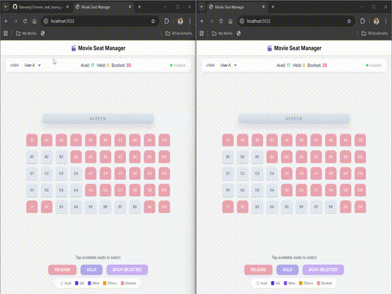
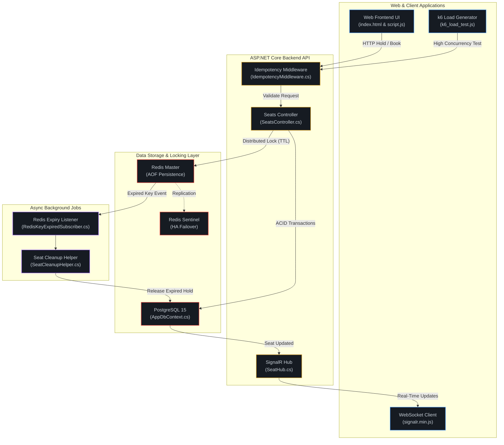
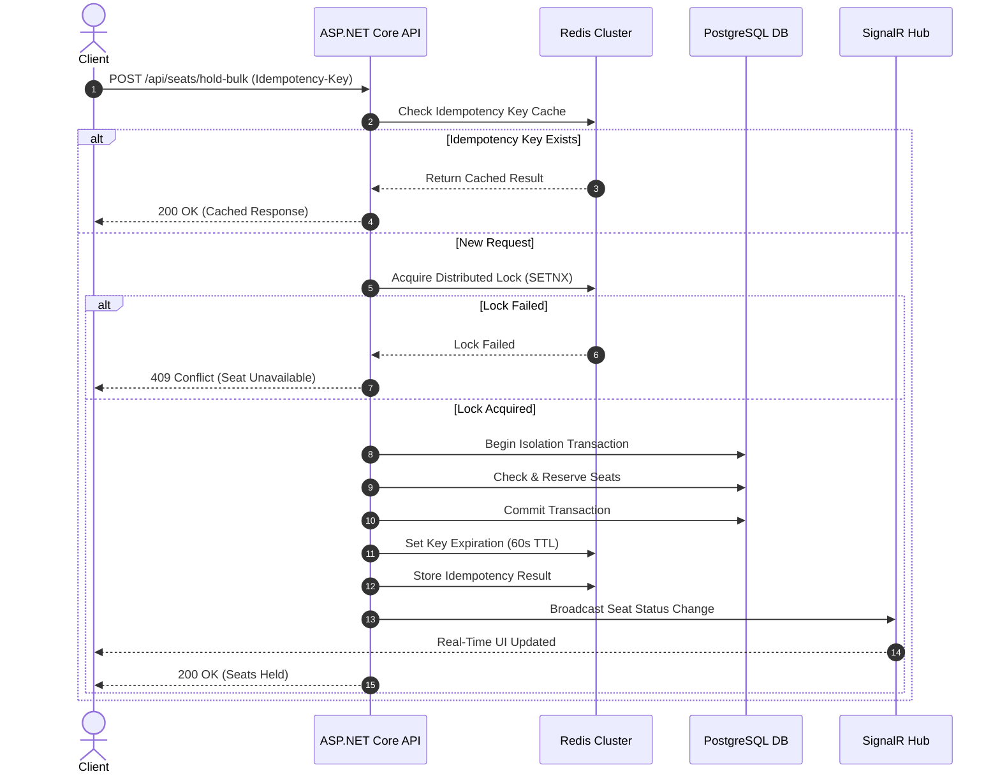

# 🎟️ Movie Seat Manager | High-Performance Booking System

A high-performance movie seat reservation system built with **ASP.NET Core, PostgreSQL, Redis, SignalR, and Docker**. The system is designed to handle thousands of concurrent booking requests while preventing double-booking through distributed locking, idempotency, and ACID transactions.

---




## 🏗️ System Architecture



---

# ⏱ Request Lifecycle



---

# 📋 Problem Statement & Solution Matrix

This project solves common high-concurrency booking challenges.

| Challenge | Solution | Technical Detail |
|-----------|----------|------------------|
| Concurrent Double Booking | Multi-Layer Concurrency | Redis distributed locks + PostgreSQL Serializable transactions |
| Abandoned Reservations | Time-To-Live (TTL) | Seat holds automatically expire after 60 seconds |
| Seat Release Delay | Event Subscriber | Redis Keyspace Notifications instantly release expired seats |
| Duplicate Requests | Idempotency Middleware | Same Idempotency-Key returns cached response |
| Lost Network Responses | Cached Results | Original response is returned on retry |
| System Restarts | Persistence | Redis AOF + PostgreSQL recovery |

---

# ⚡ Concurrency & Resilience Strategy

## 🛡️ Layer 1: Distributed Locks (Redis)

- Uses Redis **SET NX** distributed locks.
- Handles over **100,000+ lock checks/second**.
- Redis AOF persistence ensures active locks survive crashes.

---

## 🔒 Layer 2: Database Transactions (PostgreSQL)

- Uses ACID-compliant transactions.
- Guarantees atomic bulk booking.
- Prevents partial seat allocation.

---

## 📡 Layer 3: Real-Time Synchronization (SignalR)

- Broadcasts seat updates instantly.
- Eliminates client polling.
- All connected users receive live seat status updates.

---

# 🛠 Tech Stack

| Component | Technology |
|------------|------------|
| Framework | .NET 8 (LTS) |
| API | ASP.NET Core Web API |
| Database | PostgreSQL 15 / SQLite |
| Cache | Redis 7 |
| Distributed Locking | Redis SETNX |
| Real-Time | SignalR |
| Load Testing | k6 |
| Containerization | Docker & Docker Compose |

---

# 📂 Project Structure

```text
movie_seat_manager/
│
├── MovieBooking.Api/
│   ├── Controllers/
│   ├── Middleware/
│   └── wwwroot/
│
├── MovieBooking.Core/
│   ├── Entities/
│   ├── DTOs/
│   └── Interfaces/
│
├── MovieBooking.Infrastructure/
│   ├── Data/
│   ├── Services/
│   ├── BackgroundJobs/
│   └── Hubs/
│
├── docker-compose.yml
├── k6_load_test.js
└── README.md
```

---

# 🚀 Getting Started

## Prerequisites

- Docker
- Docker Compose
- .NET 8 SDK (Optional)

---

## Option 1: Docker

Clone the repository.

```bash
git clone <your-repo-url>

cd movie_seat_manager
```

Run everything.

```bash
docker-compose up --build
```

Open:

```
API
http://localhost:5000

UI
http://localhost:5000/index.html
```

---

## Option 2: Local Development

```bash
dotnet run --project MovieBooking.Api/MovieBooking.Api.csproj --urls "http://localhost:5033"
```

API

```
http://localhost:5033
```

---

# 🔌 API Reference

## 1. Fetch Seat Map

```http
GET /api/seats/{showId}
```

Returns every seat with its current status.

---

## 2. Hold Seats

```http
POST /api/seats/hold-bulk
```

Headers

```http
Idempotency-Key: 7b84f3e2-9b21-4a12-a123-f39a0e889d12
Content-Type: application/json
```

Body

```json
{
  "seatIds": [
    "3fa85f64-5717-4562-b3fc-2c963f66afa6"
  ],
  "userId": "user_1"
}
```

---

## 3. Book Seats

```http
POST /api/seats/book-bulk
```

Headers

```http
Idempotency-Key: booking-req-id-999
Content-Type: application/json
```

Body

```json
{
  "seatIds": [
    "3fa85f64-5717-4562-b3fc-2c963f66afa6"
  ],
  "userId": "user_1"
}
```

---

# 🧪 High-Concurrency Load Testing

Install k6.

```bash
k6 run k6_load_test.js
```

---

# 🎯 Test Scenario

- **500 Virtual Users (VUs)** compete for the same high-demand seats.
- Every request is processed concurrently.
- Exactly **one** user successfully reserves each seat.
- All remaining users receive **409 Conflict**.
- **Zero double bookings**.

---

# ⭐ Key Features

- ✅ Distributed Redis Locks
- ✅ PostgreSQL ACID Transactions
- ✅ Idempotent APIs
- ✅ Automatic Seat Expiration
- ✅ SignalR Real-Time Updates
- ✅ Docker Deployment
- ✅ k6 Stress Testing
- ✅ Clean Onion Architecture
- ✅ Redis Sentinel High Availability
- ✅ Production-Ready Design
